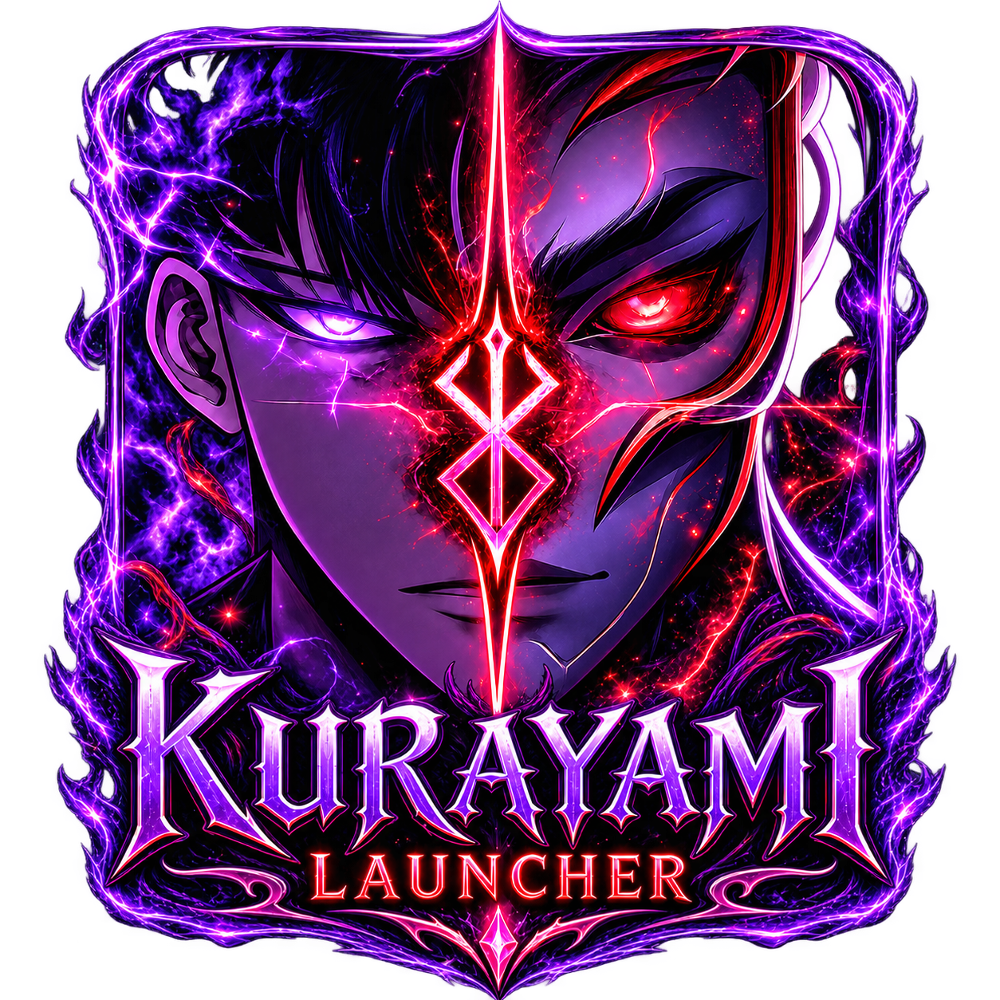
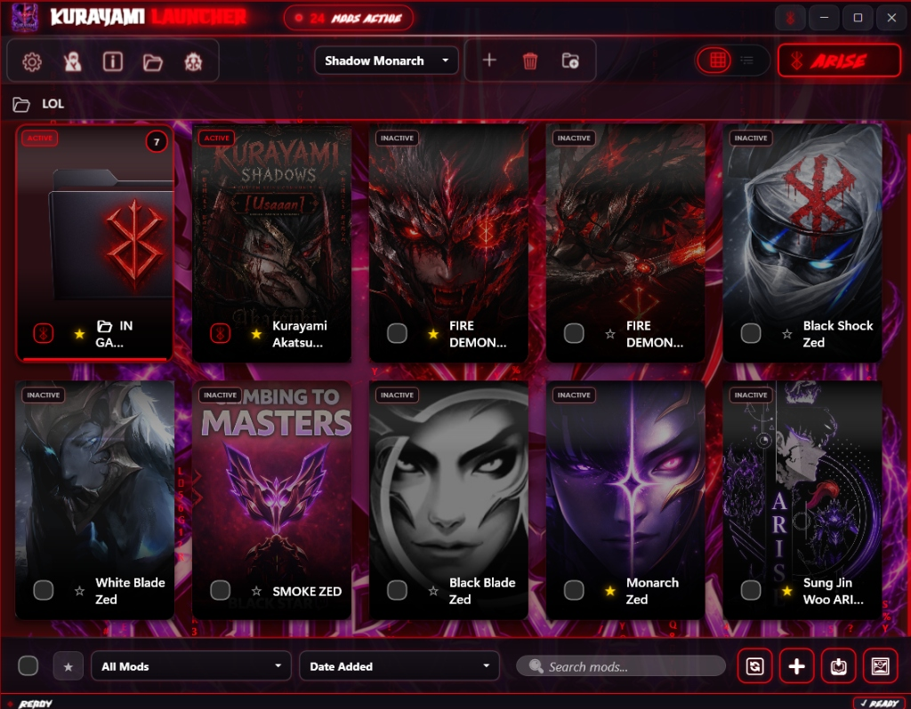
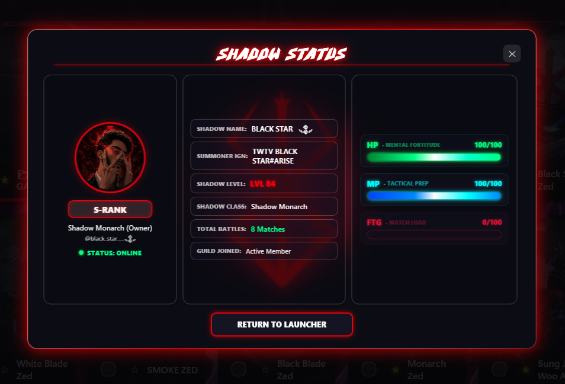
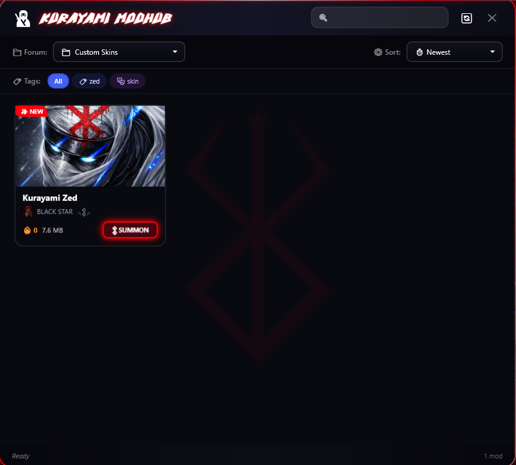

  

<h1 align="center">
  
  KURAYAMI LAUNCHER
  
</h1>

  <strong>Next-Generation Custom Skin & Mod Management Ecosystem for League of Legends</strong>
   
  <em>Engineered by BLACK STAR with ultra-low latency injection, real-time match telemetry, immersive RPG session analytics, and Discord synchronization.</em>

  

  
  
  
  
  

---

##  Overview

**Kurayami Launcher** is an advanced, high-performance custom skin loader, mod manager, and player telemetry platform built for Windows. Directed by **BLACK STAR** (*The Kurayami Shadow Monarch*), it bridges modern skin overlay injection with a **Solo Leveling RPG progression system**.

Built directly for the community, Kurayami features native Discord OAuth2 synchronization, allowing summoners and creators to access exclusive community mods directly through our **Kurayami Shadows Discord** and our upcoming official web platform.

---

##  Visual Interface Showcase

  <em>Experience an immersive, high-contrast dark fantasy command center engineered for speed, aesthetic excellence, and tactical reliability.</em>

### ⚔️ 01. The Mod Library & Control Center
> *Manage, search, sort, and organize your custom skin collections with visual cards, virtual folders, and instant one-click **ARISE** overlay injection.*

  

 

### 🎛️ 02. Shadow Status & RPG Telemetry HUD
> *Real-time player telemetry tracking Mental Fortitude (HP), Tactical Prep (MP), Combat Fatigue (FTG), and Hunter Rank progression synchronized live with your Discord identity and League match stats.*

  

 

### 🌐 03. Kurayami Cloud ModHub (Discord Synchronization)
> *Browse, filter by tags, and 1-click **SUMMON** exclusive community custom skins directly from the official Kurayami Shadows Discord forum.*

  

---

##  Core Features

*  **Mod Library & Organization:** Install, enable, disable, and organize custom skins with a visual card-based interface and virtual folder categorization. Supports elevated drag-and-drop installation (`.fantome`, `.modpkg`, `.zip`, `.wad.client`, `.7z`, `.rar`) with UIPI privilege filter bypass.
*  **Profile Management:** Create, save, switch, rename, and export custom skin presets instantly to adapt your setup for different champions and roles.
*  **The ARISE Injection Engine (Overlay Patcher):** Single-click in-memory skin overlay injection into League of Legends with pre-asset thread synchronization (`ManualResetEventSlim`) to beat Vanguard loading scan delays.
*  **Automated Base-Skin & Audio Resolution:** Built-in conflict resolver and `flags 12` WAD scanner ensure custom skin audio, VO, sound effects, and textures load cleanly without base-skin conflicts or model flickering.
*  **Automatic Updates & Diagnostics:** Automatic background update detection and built-in game path diagnostics to ensure your files stay synchronized with League patches.
*  **Dark-Fantasy Theming & Typography Suite:** Immersive Solo Leveling aesthetic with glowing HUD elements, animated cursors, custom sound effects, and 7 interchangeable typography options (*Solo Leveling Demo, Eternal, Dystopian Canticle, Heavytal, Hellock, Rovelink, UnifrakturCook*).
*  **Zero-Overhead Stealth Optimization:** When entering active matches, Kurayami trims RAM working sets and halts background UI animations, consuming near **0% CPU / RAM**.
*  **Discord-Powered Ecosystem:** Direct integration with Discord OAuth2 PKCE to verify community roles (VIP, Booster, Creator, Shadow Lord) and download curated mods directly from the Kurayami Shadows Discord.

---

##  Solo Leveling RPG HUD & Combat Telemetry

Kurayami introduces real-time RPG session tracking to protect summoner focus:

* **[FTG] Combat Fatigue & Tilt Shield:** Tracks physical and mental exertion across consecutive matches. When reaching 100% fatigue (after 3 intense games), the launcher triggers a single-time **SYSTEM ADVISORY** to stretch, hydrate, and reset mental focus.
* **[HP] Mental Fortitude:** Dynamic health gauge that reacts live to your match fatigue (starts at 100% and recovers automatically as you rest in the lobby).
* **[MP] Tactical Mana:** Channels to 100% during active mod injection and matches.
* **Shadow Rank Progression:** Level up your Hunter profile from **E-Rank Hunter** all the way to **Shadow Monarch** based on your battle history and skin synergies.
* **Triple-Redundancy Match Outcome Engine:** Detects Nexus explosions in real time through in-game port 2999 poller, LCU Client endpoints, and game r3dlogs to deliver authentic **VICTORY** and **DEFEAT** celebration toasts.

---

##  Installation & Quick Start

### Prerequisites
- **Operating System:** Windows 10 or Windows 11 (64-bit).
- **[.NET 8.0 Desktop Runtime](https://dotnet.microsoft.com/download/dotnet/8.0)** (x64).
- **[Visual C++ Redistributable 2015-2022](https://aka.ms/vs/17/release/vc_redist.x64.exe)** (x64).

### Step-by-Step Setup
1. **Download:** Download [`KurayamiSetup.exe`](https://github.com/MedSalimGh/Kurayami-Launcher/releases/latest/download/KurayamiSetup.exe) from [Official Releases](https://github.com/MedSalimGh/Kurayami-Launcher/releases/latest).
2. **Install:** Run `KurayamiSetup.exe`, select your preferred Awakening Theme (*Solo Leveling, Berserk, Hextech, or Kurayami Dark*), and click **Install**.
3. **Launch:** Open Kurayami Launcher from your Desktop shortcut or Start Menu.
4. **Locate Game:** Kurayami will auto-detect your League of Legends directory (or configure it in Settings).
5. **Install Mods:** Drag and drop `.fantome` or `.modpkg` skin files directly into the window.
6. **ARISE:** Click **ARISE** to inject your mods and dominate Summoner's Rift.

---

##  Feature Comparison

| Feature | **Kurayami Launcher** | **cslol-manager** | **LTK Manager** |
| :--- | :---: | :---: | :---: |
| **Engine & UI Platform** | **.NET 8 WPF (High Performance)** | Qt / C++ | Rust + React (Tauri) |
| **Vanguard Pre-Hook Gate** | **✅ Yes (Zero Reconnect Delay)** | ❌ No | ⚠️ Standard Hook |
| **Automated Audio Fixer (`flags 12`)** | **✅ Built-in (Automatic)** | ❌ Manual Repair | ❌ Manual |
| **Live Match Outcomes** | **✅ Real-Time (Victory / Defeat)** | ❌ None | ❌ None |
| **Player Fatigue & Tilt Shield** | **✅ Live RPG Telemetry** | ❌ None | ❌ None |
| **Discord Community Gate** | **✅ OAuth2 + Role Verification** | ❌ None | ❌ None |
| **In-Game Stealth Optimization** | **✅ Working-Set Memory Trimming** | ❌ Constant RAM Usage | ⚠️ Medium Usage |

---

##  License & Terms of Use

**Kurayami Launcher** is freeware software provided for the League of Legends modding community.

* **Usage:** Free for personal, non-commercial use.
* **Redistribution:** You may share the official `KurayamiSetup.exe` installer with credit. Reverse engineering, decompiling, or redistributing modified proprietary binaries is strictly prohibited.
* **Patcher Binaries:** Kurayami bundles standard open-source injection tools (`ltk_patcher_host.exe`, `ltk_patcher_dll.dll`, `cslol-dll.dll`), which remain governed by their respective open-source licenses.
* **Disclaimer:** Kurayami is strictly a client-side cosmetic mod manager. We do not support or condone skinhacks, memory editors, or gameplay-altering scripts. Not endorsed by or affiliated with Riot Games.

---

##  Support the Project & Connect with BLACK STAR

  
  
  
  
  
  

---

  
    
  <em>"Master your Rift experience. Every mod, every sound, every battle executed with perfection."</em>
    
  <strong>— BLACK STAR, The Kurayami Shadow Monarch</strong>
   
  <strong>Kurayami Project © 2026. All Rights Reserved.</strong>

